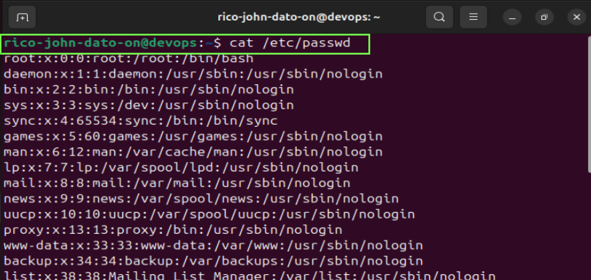

# 👤 Linux Users, Groups and Permissions

This guide explains how user accounts and groups are managed in Linux, how permissions are assigned, and why it's important for server security and collaboration.

---

## 👥 Types of Users in Linux

1. **Root User**: Superuser with full access (`UID = 0`)
2. **Standard Users**: Regular user accounts (`UID = 1000+`)
3. **Service Users**: Used by services like Apache, MySQL (not for login)

---

## 📂 Why Multiple Users?

- Separation of permissions (e.g. junior vs senior admins)
- Auditability (track who did what)
- Better security and traceability

---

## 📦 Users and Groups System Files

- Users: `/etc/passwd`
- Groups: `/etc/group`

View current users:

```bash
cat /etc/passwd
```



View current groups:

```bash
cat /etc/group
```


---

## ➕ Add New User

```bash
sudo adduser myles
```

Switch to user:

```bash
su - myles
```

---

## 🔐 Change User Password

```bash
sudo passwd myles
```

---

## ➕ Add New Group

```bash
sudo addgroup devops
```

---

## 🧑‍🤝‍🧑 Add User to Group

Set primary group:

```bash
sudo usermod -g devops myles
```

Add to additional (secondary) groups:

```bash
sudo usermod -aG admin myles
```

View user groups:

```bash
groups myles
```

---

## ❌ Remove Group or User from Group

Remove group:

```bash
sudo delgroup myles
```

Remove user from group:

```bash
sudo gpasswd -d cjbon devops
```

---

## 🛠 Create User and Assign Group Immediately

```bash
sudo adduser cjbon
sudo usermod -aG devops cjbon
```

---

## 🧾 Command Reference

| Command                     | Description                           |
| --------------------------- | ------------------------------------- |
| `adduser <name>`            | Add a new user                        |
| `addgroup <group>`          | Add a new group                       |
| `usermod -g <group> <user>` | Change user’s primary group           |
| `usermod -aG <grp1>,<grp2>` | Add user to multiple secondary groups |
| `groups <user>`             | Show user's groups                    |
| `gpasswd -d <user> <group>` | Remove user from a group              |
| `delgroup <group>`          | Delete a group                        |
| `passwd <user>`             | Set/change a user password            |
| `su - <user>`               | Switch to another user                |
| `exit`                      | Return to previous user session       |

---

🧑‍💻 _Created by Rico John Dato-on_  
🔗 [LinkedIn](https://www.linkedin.com/in/rico-john-dato-on) • [Portfolio](https://ricodatoon.netlify.app)
